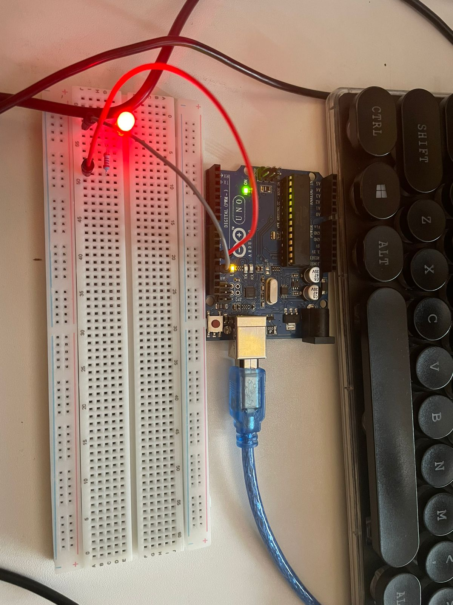
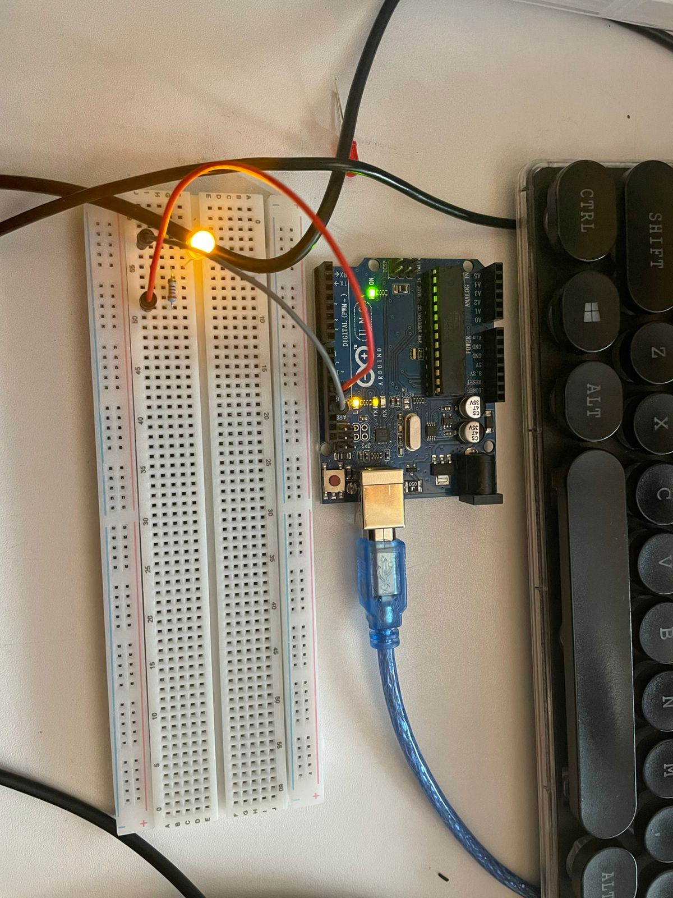
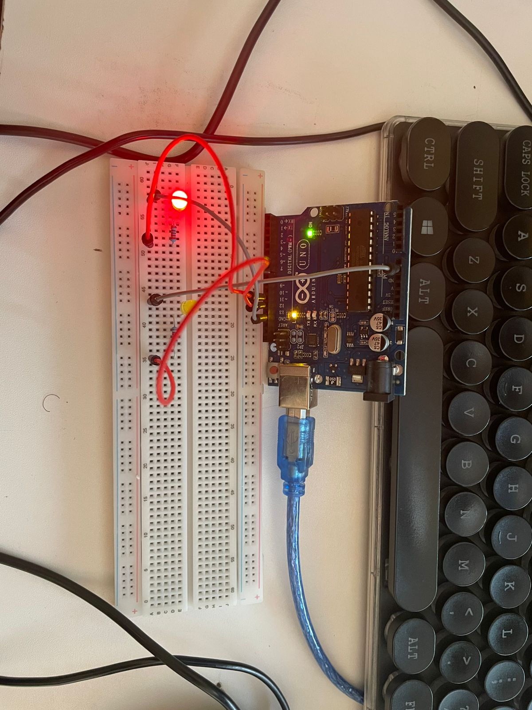
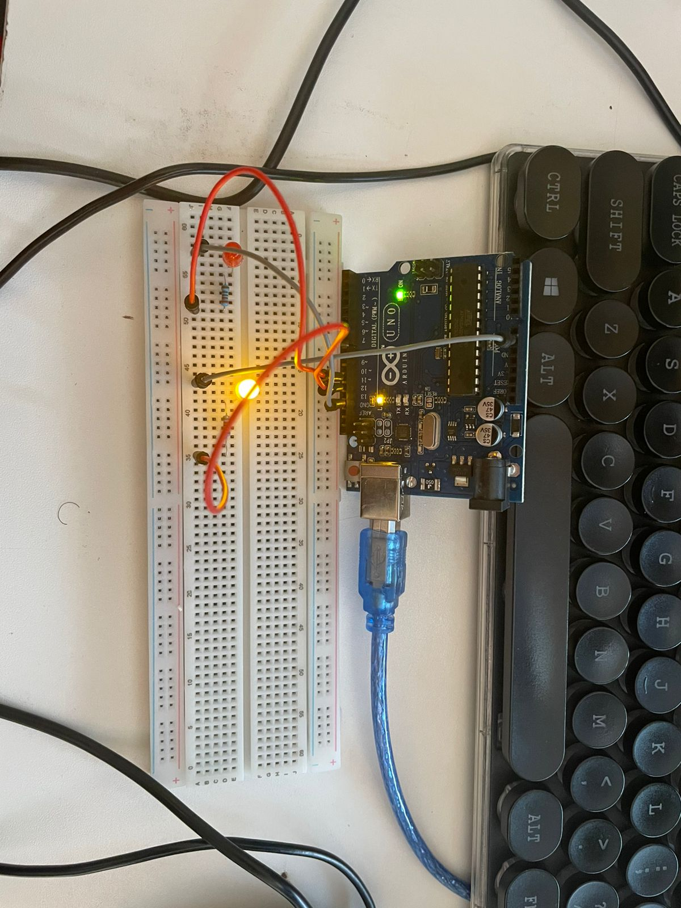
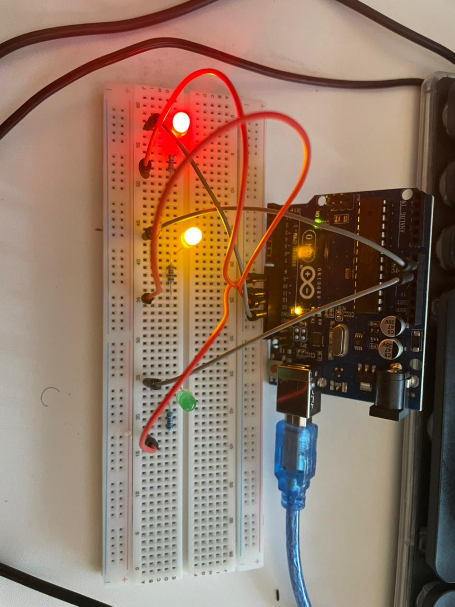

# Arduino Uno — Beginner Projects

PlatformIO + VS Code on Linux. Three projects built from scratch — LED blink, traffic light sequencer, and live temperature & humidity monitoring.

---

## Projects

### 1. Blink

Single red LED on a breadboard blinking on and off every second. The classic Hello World of embedded systems.





**Hardware:** Arduino Uno, red LED, 220Ω resistor, breadboard, jumper wires

**Wiring:**
```
Pin 12 → 220Ω → LED (+) → LED (–) → GND
```

See code → [`blink_test/src/main.cpp`](blink_test/src/main.cpp)

---

### 1b. Two-Led Blink

Double red and yellow LED on a breadboard blinking on and off every second. The classic Hello World of embedded systems.


[](assets/videos/two_led.mp4)


**Hardware:** Arduino Uno, red LED, 220Ω resistor, breadboard, jumper wires

**Wiring:**
```
Pin 12 → 220Ω → LED (+) → LED (–) → GND
```

See code → [`blink_test/src/main.cpp`](blink_test/src/main.cpp)

---

### 2. Traffic Light

Red, yellow and green LEDs sequencing like a real UK traffic light — Red → Red+Yellow → Green → Yellow → repeat.

[](assets/videos/traffic_light.mp4)
<!-- Replace traffic_light.jpg with your actual filename -->

**Hardware:** Arduino Uno, red + yellow + green LEDs, three 220Ω resistors, breadboard, jumper wires

**Wiring:**
```
Pin 11 → 220Ω → RED    LED (+) → LED (–) → GND
Pin 12 → 220Ω → YELLOW LED (+) → LED (–) → GND
Pin 13 → 220Ω → GREEN  LED (+) → LED (–) → GND
```

See code → [`traffic_light/src/main.cpp`](traffic_light/src/main.cpp)

---

### 3. DHT11 — Temperature & Humidity

Live temperature and humidity readings from the DHT11 sensor printed to serial every 2 seconds. Breathe on the sensor and watch the humidity spike.

[](assets/videos/dht11_demo.mp4)
<!-- 
  Replace dht11_thumbnail.jpg with a screenshot frame from your video
  Replace dht11_demo.mp4 with your actual video filename
  If you upload to YouTube instead, replace the whole link with your YouTube URL
-->

**Hardware:** Arduino Uno, DHT11 module, jumper wires

**Wiring:**
```
DHT11 VCC  → 5V
DHT11 GND  → GND
DHT11 DATA → Pin 7
```

**Library:** `adafruit/DHT sensor library @ ^1.4.4` — add to `platformio.ini` under `lib_deps`

See code → [`dht11_test/src/main.cpp`](dht11_test/src/main.cpp)

---

## Setup

**Requirements:** VS Code, PlatformIO extension, Linux (Ubuntu)

**Upload:**
```bash
pio run --target upload
```

**Serial monitor:**
```bash
pio device monitor --baud 9600
```

**Linux USB permission fix** (run once):
```bash
curl -fsSL https://raw.githubusercontent.com/platformio/platformio-core/develop/platformio/assets/system/99-platformio-udev.rules | sudo tee /etc/udev/rules.d/99-platformio-udev.rules
sudo usermod -a -G dialout $USER
```
Then log out, log back in, replug the Arduino.

---

## Written By
### DARLENE WENDIE